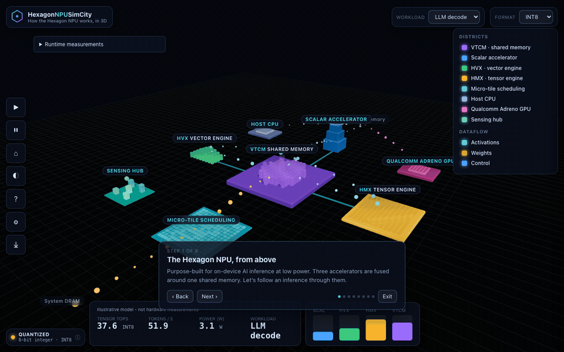
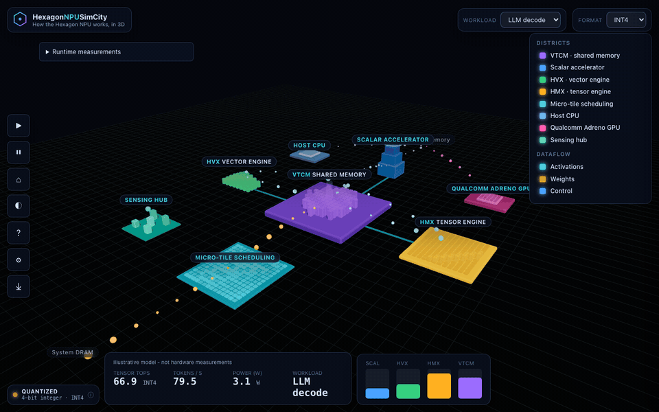

# HexagonNPUSimCity

**Walk through the Qualcomm Hexagon NPU. Watch a tensor flow. Understand on-device AI.**

An explorable 3D model where districts are the parts of the Hexagon™ NPU and
motion is the dataflow between them. Follow an inference from weights in memory,
through the scalar, vector and tensor accelerators fused around a shared memory,
and back out again.

No installation to explore — it runs in a browser with WebGL2. View here: https://eoinjordan.github.io/HexagonNPUSimCity/

For measured hardware work, see [QCS6490 NPU support](#qcs6490-npu-support-work)
and the [complete setup and validation guide](docs/qcs6490-npu.md).
The [documentation map](#documentation) covers development, installers,
runtime measurements, Arduino apps, and release procedures.

### The NPU at a glance

Districts are NPU components; the moving particles are the dataflow (cyan activations, orange weights from DRAM). Press `N` to swing between night and day.


### Guided tour

Press `T` to follow one inference through the fused pipeline — the camera glides between districts and explains each one.




> **Independent & non-commercial.** Not affiliated with, sponsored by, or endorsed
> by Qualcomm. Hexagon, Snapdragon, Adreno and Oryon are trademarks of Qualcomm
> Incorporated. The city's simulation figures are **illustrative** and scaled to be readable —
> a teaching model, **not** a datasheet or a measurement of any real silicon.

Inspired by [PGSimCity](https://github.com/NikolayS/PGSimCity), which does the
same thing for PostgreSQL.

## Native and measured runtimes

### v1.1.0 Preview Installers

The [v1.1.0 release](https://github.com/eoinjordan/HexagonNPUSimCity/releases/tag/v1.1.0)
refreshes all installers with the QCS6490 Runtime panel and current web app:

| Download | Scope |
| --- | --- |
| [Android ARM64 APK](https://github.com/eoinjordan/HexagonNPUSimCity/releases/download/v1.1.0/HexagonNPUSimCity-arm64-cpu-preview.apk) | Debug-signed, CPU-only native arithmetic preview |
| [Windows ARM64 MSI](https://github.com/eoinjordan/HexagonNPUSimCity/releases/download/v1.1.0/HexagonNPUSimCity-arm64.msi) | Windows 11 on ARM and WebView2; QNN requires compatible hardware/drivers |
| [Debian/Ubuntu package](https://github.com/eoinjordan/HexagonNPUSimCity/releases/download/v1.1.0/HexagonNPUSimCity-all.deb) | Static visualization and Python launcher; amd64/arm64, no bundled NPU runtime |
| [Standalone web ZIP](https://github.com/eoinjordan/HexagonNPUSimCity/releases/download/v1.1.0/HexagonNPUSimCity-web.zip) | Built WebGL application for static hosting |
| [SHA256SUMS](https://github.com/eoinjordan/HexagonNPUSimCity/releases/download/v1.1.0/SHA256SUMS) | Integrity checks for all four packages |

The board gateway, Qualcomm libraries, and model files require the separate
[QCS6490 setup](docs/qcs6490-npu.md#multi-workload-gateway); installing a preview
does not enable NPU inference automatically. See the
[release notes](docs/release-notes.md) for signing and hardware-validation limits.

Android ARM64 and Windows ARM64 shells can run a small, output-checked ONNX
arithmetic workload with explicit CPU/QNN selection. The default Android preview
is CPU-only; a QNN-enabled build requires matching SDK libraries. Windows has a
QNN-backed build and MSI packaging workflow. Android/Windows NPU execution and
Windows MSI installation still require target-device verification.

Ollama, llama.cpp and LM Studio adapters provide separate measured timings through
an opt-in local service, never inferred NPU utilization. See the
[native and runtime guide](docs/native.md) for build commands, release automation,
security boundaries and limitations.

Android example source:
[edgeimpulse/example-android-inferencing](https://github.com/edgeimpulse/example-android-inferencing)
and its [QNN example](https://github.com/edgeimpulse/example-android-inferencing/tree/main/qnn-hardware-acceleration).

## QCS6490 NPU Support Work

**Eoin Jordan's NPU enablement work** establishes a reproducible native Ubuntu
path on the RUBIK Pi 3: verified SSH/cDSP access, a QNN HTP graph exporter,
independent output checking, vendor hardware profiling, and retained evidence.
The [full QCS6490 guide](docs/qcs6490-npu.md) contains prerequisites, build/run
commands, artifact definitions, troubleshooting, and the runtime investigation.

**Working:** quantized arithmetic validation and MobileNet-v2 image classification
through QAIRT's `qnn-net-run`. A deployed gateway now owns the board's loopback
port 8088, with the original language/VLM model retained as a CPU worker on 8089.
**Not established:** NPU LLM generation. The tested GenieX 0.6.1 Q4_0 path mapped
v68 to a v73 kernel and aborted; the gateway explicitly labels its language
fallback as CPU, not NPU.

| Gateway workload | Actual execution | Checked evidence |
| --- | --- | --- |
| Vision / conv | MobileNet-v2 W8A16 on QNN HTP; CPU image preprocessing and postprocessing | Positive HTP/convolution profiles; 1,000 logits compared with the identical DLC on SNPE CPU, cosine similarity 0.999665 and matching top prediction |
| LLM decode / existing VLM API | Existing Qwen2.5-VL-3B model on CPU | Text and image requests passed through the replacement entry point; measured token rates are CPU rates |
| Idle | No inference dispatched by that request | Gateway request counter unchanged; global board/NPU utilization and power are unmeasured |

Use the [gateway setup and rollback instructions](docs/qcs6490-npu.md#multi-workload-gateway)
to access the live board UI. The Runtime panel provides explicit workload runs
and optional PNG/JPEG upload. Simulation controls do not automatically start
hardware workloads or convert the city's meters into measured counters.
See the [vision comparison](docs/measurements/qcs6490-vision.json) and
[gateway acceptance report](docs/measurements/qcs6490-gateway.json).


Recorded from the deployed board on **2026-09-18**. The Runtime panel shows
actual completed requests; the surrounding city remains illustrative. Playback
speed is edited for readability, not a latency benchmark. Recording provenance
and backend summaries are in [the media manifest](docs/media/recordings.json).

### Validated QCS6490 NPU results

Measured on **2026-09-18** on a **Thundercomm RUBIK Pi 3**, with QCS6490 / Hexagon
v68, Ubuntu 24.04.3 LTS, and **Qualcomm QAIRT 2.39.0.250926** (`qnn-net-run`,
QNN HTP backend). These are actual hardware-test results, separate from the
city's illustrative meters.

| Measurement | Validated result |
| --- | --- |
| Workload | Dense UINT8 matrix multiply: `[32,64] x [64,64] -> [32,64]` |
| Quantization | Affine UINT8; scale `0.125`, zero point `128` for inputs, weights and outputs |
| Distinct input fixtures | 8 |
| Total HTP executions | 32 |
| Warm-up executions excluded from timing statistics | 8 |
| Measured executions | 24, with detailed profiling enabled |
| Exact output comparisons | **65,536 / 65,536 passed** |
| Mean QNN execution time | **0.4706 ms** |
| Median QNN execution time | 0.4705 ms |
| Minimum / maximum QNN execution time | 0.420 / 0.518 ms |
| Hardware-execution evidence | Positive accelerator and matrix-operation cycle counts in all 32 profiles |
| CPU inference fallback | None; only `libQnnHtp.so` selected |
| NPU LLM generation throughput | **Not validated**; NPU tokens/s unavailable |

Timings are **host-side QNN graph-execution durations**, including RPC and
profiling overhead, but excluding context loading and tensor file I/O. This is
a small arithmetic correctness/integration test, not a peak TOPS benchmark,
HMX-only measurement, utilization/power measurement, or proof of LLM support.
It does not calibrate the city's simulated counters.

Evidence: [raw measurements and binary fingerprints](docs/measurements/qcs6490-qnn.json),
[board preflight](docs/measurements/qcs6490-preflight.json),
[graph and fixture exporter](tools/qnn-smoke.cpp), and
[independent output/profile validator](tools/qnn_validate.py).

## Linux Package

The release pipeline packages `HexagonNPUSimCity-all.deb`. It is
`Architecture: all` and depends on Python >=3.8, so the payload is portable
between amd64 and arm64 Debian-family systems, including Ubuntu boards:

```sh
sudo apt install ./HexagonNPUSimCity-all.deb
hexagon-npu-simcity            # serves on 127.0.0.1:8770 and opens a browser
```

It installs a desktop entry and serves the bundled build on loopback only.
Override the port with `HEXAGON_PORT`. Build it yourself with `node tools/deb.mjs`
after `npm run build`, with `dpkg-deb` installed. Without `dpkg-deb`, the script
only stages the package. See [Linux packaging](docs/native.md#linux-debian-package)
for install/remove and headless access. This is a WebGL visualization package,
not an NPU driver, QAIRT installer, or LLM distribution.

## Arduino App Lab Connector

> The supplied UNO Q bench setup measures CPU token throughput, not CPU
> utilization. A device's NPU capability alone does not prove runtime support.

The [Arduino connector](arduino/README.md) supplies two App Lab apps:
**HexagonNPUCity** hosts the visualization and a separate illustrative Python
model/API that drives RGB LEDs on port 7080. Its browser controls and LED state
are not currently synchronized. **HexagonNPUCity Bench**, on port 7000, displays
a host-side `llama-bench` sweep across five GGUF formats in an embedded city.

The observed UNO Q QRB2210 BSP has no cDSP/HTP path for this llama.cpp backend.
Other boards, including VENTUNO Q, need their own compatible runtime and device
validation. Bench labels come from tool-reported metadata, not independently
verified offload profiles. Received samples change the separate readout and
display precision; the main simulation meters remain illustrative. See
[the measurement boundary](docs/verification.md#arduino-app-lab-measurements).

## See it in motion

> The four simulation GIFs were refreshed from the running app on 2026-09-18.
> Their city metrics are **illustrative**, not hardware measurements. The separate
> QCS6490 clip above shows the explicitly labelled measured Runtime panel.


### Quantization / precision

Switch **format** (INT4 → INT8 → INT16 → FP16) and the HMX *Tensor TOPS* and *tokens/s* readouts scale with the chosen precision — this is how the model represents quantization. The coefficients are illustrative; the arithmetic of integer affine quantization is verified separately in [docs/verification.md](docs/verification.md).



### Workloads under different conditions

Switch **workload** — LLM decode, Vision / conv, Idle — and watch the scalar, HVX and HMX utilisation bars and the accelerators themselves respond.


See [recording instructions](docs/verification.md#documentation-recordings) to
regenerate the GIFs from the current application, including canvas and file checks.

## Quick start

Use Node **>=22.18** and a WebGL2-capable browser. From the repository root:

```bash
npm ci
npm run dev      # open the printed localhost URL
```

```bash
npm run build      # production build to dist/
npm run preview    # serve the built site
npm run typecheck  # tsc --noEmit
npm test           # module unit and component integration tests
npm run test:coverage
npm run test:browser # real WebGL component tests (install Chromium first)
npm run test:app     # production app tests under a Pages-style subpath
```

`npm test` does not include Playwright, the Arduino Python suite, or physical
NPU execution. Test/build requirements for each surface are listed in
[AGENTS.md](AGENTS.md#5-testing-ci-release--deploy).

## What you are looking at

| District | What it is |
|---|---|
| **VTCM** (centre, violet) | Vector Tightly-Coupled Memory — NPU-local memory that keeps working tiles close to the engines so they share data without constant DRAM traffic. |
| **Scalar accelerator** (north, blue) | Control flow and orchestration: sequences the other engines and runs the parts of a model that aren't big matrix math. |
| **HVX** (west, green) | The Hexagon Vector eXtensions SIMD engine — activations, normalisation and elementwise work between matrix multiplies. |
| **HMX** (east, amber) | The Hexagon Matrix eXtensions tensor engine — a multiply-accumulate array for convolutions and matmuls. Most of the TOPS live here. |
| **Micro-tile scheduling** (south, cyan) | A *scheduling concept*, not a separate block: large ops are split into tiles that fit local memory and reuse data. |
| **Host CPU / Adreno GPU / Sensing hub** (corners) | System context *outside* the NPU. Shown to place the NPU in the wider Qualcomm AI Engine, not simulated as consumers of VTCM. |

Colour is meaning, never decoration: **scalar is blue**, **HVX is green**,
**HMX is amber**, **VTCM is violet**, **activations are cyan**, **weights are
orange**, and system-context labels are drawn quieter and dashed.

## Controls

Drag to orbit, wheel/pinch to zoom, Shift-drag to pan, click a district to
inspect it. Press **?** for the full key map and colour legend.

| Key | Action | Key | Action |
|---|---|---|---|
| `T` | Guided tour | `N` | Day / night |
| `K` / `P` | Pause / resume | `R` | Reset |
| `H` | Establishing shot | `1` `2` `3` | LLM / Vision / Idle workload |
| `?` / `/` | Keys & legend | `Esc` | Dismiss the active overlay/tour or selection |

Try switching **precision** (INT4 → FP16) and watch the tensor engine's TOPS and
the token rate change, or run the **Vision / conv** workload and watch HMX light up.

The seven toolbar actions cover tour, pause, home camera, day/night, help,
settings, and downloads. Select a district in the scene or legend to inspect it.
Shortcuts leave input/select fields and OS modifier-key combinations untouched.

**Settings** changes illustrative per-format TOPS/token ceilings, the selected
workload's activity/occupancy/tile targets, and power coefficients. The ONNX
opset checklist is display/configuration metadata, not runtime compatibility
validation. Changes last for the current page session; **Restore defaults**
resets coefficients, whereas **Reset** resets simulation state and camera while
retaining those settings. Day/night preference is saved locally when storage is
available. Reduced-motion preferences suppress animated packet/world movement.

**Runtime measurements** is opt-in and separate from the illustrative meters.
The [runtime guide](docs/native.md) describes local inference-server connections
and explicit native CPU/QNN actions. **Get the app** links Android, Windows and
Linux installers through stable GitHub release URLs; those links require a
published release with matching asset names, not merely a pushed tag or draft.

## How much to trust this

The city is a **model, not an emulator**. The 3D city, the utilisation bars and the
throughput figures are scaled to make the architecture observable. The simulation
is a small deterministic behaviour model (`src/sim/`); it does not execute any real
Hexagon workload and its numbers should not be cited as performance data. Optional
native workload and local-runtime measurements are separately labelled and are
not used to claim measured values for the city's utilization or power meters.

Architecture background is drawn from Qualcomm's public description of the Hexagon
NPU (fused scalar + vector + tensor accelerators, a large shared memory, and
micro-tile inferencing within the heterogeneous Qualcomm AI Engine).

See the [calculation and quantization verification](docs/verification.md) for
primary sources, executable ONNX reference examples, integer ranges, storage
calculations and the boundary between verified arithmetic and unverified hardware
performance. Format labels are not a universal Hexagon support matrix; FP16 and
integer quantization are different, and real models need calibration and testing.

## References & sources

The district model (fused scalar + vector + tensor accelerators around a large shared
memory, micro-tile inferencing, and the heterogeneous Qualcomm AI Engine) is drawn from
Qualcomm's public materials. The on-screen figures are **not** taken from these sources —
see [docs/verification.md](docs/verification.md) for the source-by-source audit and the
verified integer-quantization examples.

**Qualcomm — Hexagon NPU & AI Engine**
- [Qualcomm Hexagon NPU](https://www.qualcomm.com/processors/hexagon) — primary reference for the districts and dataflow.
- [Qualcomm AI Engine](https://www.qualcomm.com/products/technology/processors/ai-engine) — heterogeneous CPU + GPU + NPU.
- [Qualcomm AI (overview)](https://www.qualcomm.com/artificial-intelligence)
- [Qualcomm Oryon CPU](https://www.qualcomm.com/processors/oryon) · [Qualcomm Adreno GPU](https://www.qualcomm.com/processors/adreno)
- [Qualcomm AI Hub](https://aihub.qualcomm.com/)

**Qualcomm — platform figures & quantization workflow** (used only in the verification notes, clearly labelled illustrative vs. cited)
- [Snapdragon X Elite](https://www.qualcomm.com/laptops/products/snapdragon-x-elite) and its [product brief (87-71417-1 Rev F, PDF)](https://docs.qualcomm.com/doc/87-71417-1/87-71417-1_REV_F_Snapdragon_X_Elite_Product_Brief.pdf) — the “up to 45 TOPS” figure.
- [AI Hub quantization guide](https://workbench.aihub.qualcomm.com/docs/hub/quantize_examples.html) and [profiling guide](https://workbench.aihub.qualcomm.com/docs/hub/profile_examples.html) — weight/activation precision choices and HTP FP16 support caveats.

**Quantization semantics**
- ONNX [QuantizeLinear](https://onnx.ai/onnx/operators/onnx__QuantizeLinear.html) / [DequantizeLinear](https://onnx.ai/onnx/operators/onnx__DequantizeLinear.html) — the integer affine model reproduced in [`src/sim/quantization.ts`](src/sim/quantization.ts).

## Project layout

```
src/
  core/     types, palette, math utilities, event bus
  sim/      the behaviour model + fixed-step clock (+ tests)
  engine/   renderer, camera rig, CSS2D labels, dataflow, picking
  world/    the districts: ground, VTCM, accelerators, tiling, system context
  ui/       HUD, inspector, guided tour, help overlay, keyboard controls
  runtime/  local/native measurements and App Lab message validation
  main.ts   boot + wiring
native/     Android and Windows preview hosts
arduino/    illustrative API/LED app and measured bench app
tools/      packaging, runtime proxy, model generation and QCS6490 validation
docs/       verification, runtime guides, NPU support, measurement records
.github/    CI, Pages, release and connector automation
```

## Documentation

| Guide | Scope |
| --- | --- |
| [QCS6490 NPU support](docs/qcs6490-npu.md) | Eoin Jordan's hardware work, exact reproduction, profiles, results, and blocked LLM paths |
| [Verification](docs/verification.md) | Architecture sources, all default coefficients, quantization semantics, and measurement boundaries |
| [Native packages and runtimes](docs/native.md) | Android/Windows builds, Debian packaging, local LLM adapters, ports, security, and release gates |
| [Arduino connector](arduino/README.md) | Both App Lab apps, APIs, LEDs, deployment, CPU sweep, and current limitations |
| [App Lab in-app README](arduino/app/README.md) | Short instructions shipped with the illustrative board app |
| [Agent/developer guide](AGENTS.md) | Architecture, commands, extension recipes, and required checks |
| [Contributing](CONTRIBUTING.md) | Change scope, evidence expectations, and PR checklist |
| [Preview release notes](docs/release-notes.md) | Four distribution assets and publication caveats |

## Contributing & extending

New here — or an AI agent picking this up? Start with **[AGENTS.md](AGENTS.md)**:
architecture, conventions, the CI/deploy pipeline, and copy-paste recipes for
adding a district, workload, illustrative figure, UI overlay or dataflow.
[CONTRIBUTING.md](CONTRIBUTING.md) is the short version.

## License

[Apache-2.0](LICENSE). See [NOTICE](NOTICE) for trademarks and the model disclaimer.
