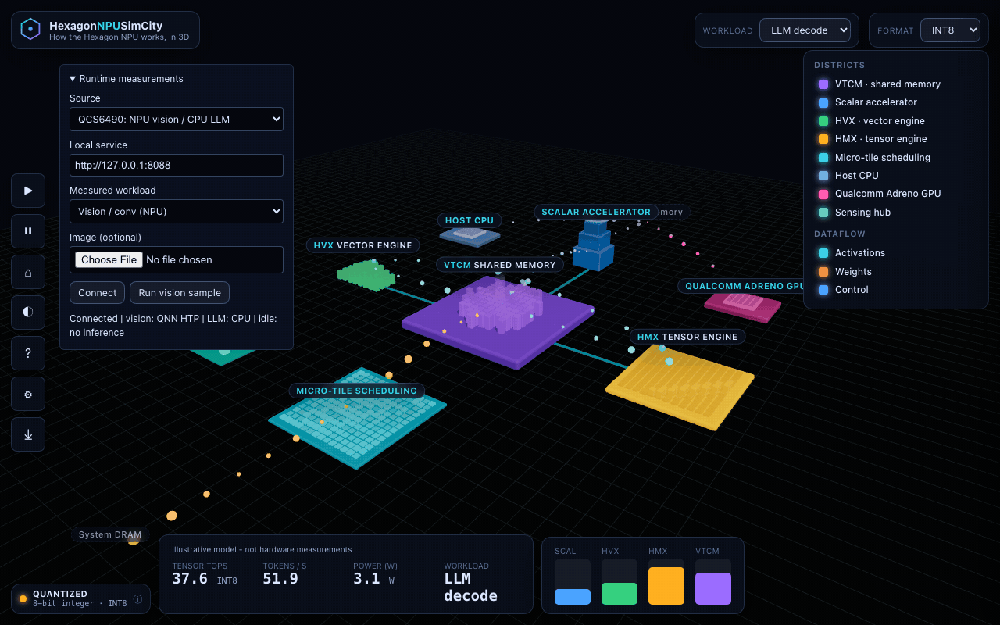

# QCS6490 NPU Support And Validation

This guide documents **Eoin Jordan's QCS6490 NPU enablement and validation work**
for HexagonNPUSimCity. The working path is native Ubuntu ARM64 with Qualcomm
QAIRT's **QNN HTP backend** for matrix validation and MobileNet-v2 vision. The
multi-workload gateway keeps language/VLM on an explicitly CPU-only worker;
it is not a working NPU LLM server. Results below were recorded on **2026-09-18**.

## Status At A Glance

| Capability | Observed status |
| --- | --- |
| Passwordless SSH to `ubuntu@ubuntu.local` | Verified with public-key authentication and strict host-key checking |
| QCS6490 / Hexagon v68 identification | Verified on a Thundercomm RUBIK Pi 3 |
| Non-root cDSP access | Verified after adding `ubuntu` to the existing `fastrpc` group |
| QAIRT DSP calculator diagnostic | Passed; proves DSP RPC readiness, not an LLM or HMX workload |
| Quantized dense matrix graph on QNN HTP | Passed with Qualcomm's `qnn-net-run` |
| Exact output checks and accelerator profiles | Passed for every one of 32 executions |
| MobileNet-v2 W8A16 image classification | NPU inference with positive convolution profiles; same-DLC CPU numerical comparison passed |
| llama.cpp / GenieX GGUF NPU inference | Not working in the tested configurations; see the compatibility section |
| Gateway and city Runtime panel | Explicit NPU vision, CPU LLM and no-dispatch idle actions; simulation meters stay illustrative |
| Server replacement | Gateway owns port 8088; original CPU VLM worker moved to 8089 with a reversible systemd override |

## What The Support Work Adds

- Secure board access and verified unprivileged FastRPC permissions.
- [A native C++ graph exporter](../tools/qnn-smoke.cpp), selecting only
  `libQnnHtp.so` and HTP provider ID `6`. It builds a quantized graph and exports
  eight input fixtures with independently calculated expected outputs.
- [A Python validator](../tools/qnn_validate.py), using Qualcomm's runner and
  profiler, independently recomputing the fixtures, checking every output byte,
  and refusing missing, invalid, or incomplete accelerator evidence.
- [Off-device validator tests](../tools/test_qnn_validate.py), covering incorrect
  outputs, missing results, CSV parsing, invalid profile values, and timing units.
- [A saved hardware report](measurements/qcs6490-qnn.json), containing the method,
  latency samples, hardware-profile evidence, and SHA-256 binary fingerprints.
- [A multi-workload gateway](../tools/qcs6490_runtime.py) with loopback APIs,
  NPU-only image classification, explicit CPU language fallback and idle state.
  Its [tests](../tools/test_qcs6490_runtime.py) cover evidence checks, routing,
  concurrency, HTTP boundaries and streaming compatibility.

No Qualcomm SDK, DSP firmware, vendor model binaries, or private keys are
redistributed in this repository. The existing simulator defaults are unchanged.

## Tested Environment

| Item | Recorded value |
| --- | --- |
| Board | Thundercomm RUBIK Pi 3 |
| SoC | QCS6490, SoC ID `498`, revision `1.0` |
| Accelerator | Hexagon architecture v68 / QNN HTP |
| Operating system | Ubuntu 24.04.3 LTS, `aarch64` |
| Python | 3.12.3 on the board; validator requires Python 3.11+ |
| Native compiler | GCC 13.3.0, C++17 |
| Runtime | QAIRT `2.39.0.250926` |
| Vendor tool build | `v2.39.0.250925215840_163802` |
| Reported QNN core API | `2.29.0` |
| Host libraries/tools | `lib/aarch64-ubuntu-gcc9.4`, `bin/aarch64-ubuntu-gcc9.4` |
| DSP skeletons | `lib/hexagon-v68/unsigned` |

These directory names are the SDK's target names, not a requirement to downgrade
Ubuntu's compiler to GCC 9.4. The existing QAIRT installation was reused; there
was no firmware replacement, system driver upgrade, or reboot.

The [preflight report](measurements/qcs6490-preflight.json) is a historical
llama.cpp compatibility snapshot taken before the successful arithmetic run.
Its `status: "blocked"` does not contradict the later QNN arithmetic report.

## Validated Results

| Measurement | Result |
| --- | --- |
| Graph | Dense matrix multiply: `[32,64] x [64,64] -> [32,64]` |
| Input, weight, output format | Affine UINT8, scale `0.125`, zero point `128` |
| Distinct input fixtures | 8, repeated four times |
| HTP executions | 32 |
| Warm-up executions excluded from statistics | 8 |
| Measured executions | 24 |
| Exact output comparisons | 65,536 / 65,536 passed |
| Mean QNN execution time | 0.4706 ms |
| Median QNN execution time | 0.4705 ms |
| Minimum / maximum | 0.420 / 0.518 ms |
| Profile evidence | Positive accelerator time, accelerator cycles, and `dense_matmul` cycles in all 32 runs |
| CPU inference fallback | None; no CPU backend is selected |
| NPU LLM tokens/s | Unavailable; no successful NPU LLM run |

The headline times are **host-side QNN execution times**, including RPC and
detailed profiling overhead. They exclude graph compilation, context loading,
and tensor file I/O. The report also preserves separate accelerator microseconds
and cycle counts; do not confuse those with host latency or convert cycles to
time using an assumed clock frequency.

This small correctness/integration workload is not a controlled peak-throughput
benchmark. Other board services were left running, and no fixed clock, thermal,
or power protocol was imposed. It establishes HTP execution, not HMX-only
attribution, model accuracy, measured TOPS, utilization, watts, or LLM performance.
The host still performs compilation, RPC, I/O, and output checking.

## Reproduce The Working Path

### 1. Verify Board Access

From the development machine, use the board's actual hostname or IP:

```sh
ssh -o BatchMode=yes -o StrictHostKeyChecking=yes ubuntu@ubuntu.local \
  'uname -sm; cat /sys/devices/soc0/machine; id; test -r /dev/fastrpc-cdsp && test -w /dev/fastrpc-cdsp'
```

For initial setup, verify the SSH host fingerprint through a trusted channel,
then use `ssh-copy-id` with your **public** key. Enter any password directly in
the terminal. Do not copy a private key to the board or disable host verification.
The tested IP was `192.168.1.7`, but DHCP can change it.

If FastRPC access is missing, a board administrator can add the account to the
existing group, then reconnect so the new membership takes effect:

```sh
sudo usermod -aG fastrpc ubuntu
```

Use the BSP's device permissions; do not make device nodes world-writable.

### 2. Prepare Dependencies

The board needs Python 3.11+, a C++17 compiler, the `nlohmann-json3-dev` headers,
the BSP FastRPC libraries, and an appropriately licensed QAIRT installation with
Linux ARM64 host libraries and matching v68 skeletons. The recorded run used the
board's existing QAIRT `2.39.0.250926` and installed `nlohmann-json3-dev`.

```sh
sudo apt-get install build-essential python3 nlohmann-json3-dev
export SDK_ROOT="$HOME/qairt/2.39.0.250926"
export QNN_INCLUDE="$SDK_ROOT/include/QNN"
test -f "$QNN_INCLUDE/QnnInterface.h"
test -f "$SDK_ROOT/lib/aarch64-ubuntu-gcc9.4/libQnnHtp.so"
test -f "$SDK_ROOT/lib/hexagon-v68/unsigned/libQnnHtpV68Skel.so"
```

A runtime-only QAIRT installation may omit headers. Set `QNN_INCLUDE` to a
compatible, legally obtained QNN header directory instead. The recorded build
used an external header snapshot from kantv commit
`01a49bb2d3dc963d920ce7b6827524c8e6c0a70a`, under
`~/hexagon-npu-validation/kantv-qnn/prebuilts/include/QNN`; the runtime remained
QAIRT 2.39. This records provenance, not a redistribution grant for those headers.
For a new setup, prefer your licensed SDK headers and revalidate the build.

### 3. Copy And Build The Exporter

From this repository's root on the development machine:

```sh
ssh ubuntu@ubuntu.local 'mkdir -p "$HOME/hexagon-npu-validation"'
scp tools/qnn-smoke.cpp tools/qnn_validate.py \
  ubuntu@ubuntu.local:hexagon-npu-validation/
```

On the board, with `QNN_INCLUDE` set as above:

```sh
g++ -std=c++17 -O2 -Wall -Wextra -Werror \
  -I "$QNN_INCLUDE" "$HOME/hexagon-npu-validation/qnn-smoke.cpp" \
  -ldl -o "$HOME/hexagon-npu-validation/qnn-smoke"
```

The exporter is Linux ARM64-only. It dynamically loads the installed QNN library;
it does not link or package Qualcomm binaries into the web app.

### 4. Execute And Validate

On the board:

```sh
python3 "$HOME/hexagon-npu-validation/qnn_validate.py" \
  --sdk-root "$SDK_ROOT" \
  --exporter "$HOME/hexagon-npu-validation/qnn-smoke" \
  --output-dir "$HOME/hexagon-npu-validation/validated"
```

The validator sets `QNN_LIB_PATH` and `LD_LIBRARY_PATH` to the SDK's Linux ARM64
library directory and `ADSP_LIBRARY_PATH` to its v68 skeleton directory. It is
currently specific to QCS6490 and this SDK directory layout, not an auto-detecting
runner for every Snapdragon generation.

It performs the following checks in a new `run-*` directory:

1. Exports the graph and eight fixtures; requires HTP backend ID `6` and SoC
   `QCS6490` in the exporter manifest.
2. Recomputes inputs and expected values in Python, independently of the C++
   implementation, and compares them with the exported fixtures.
3. Runs `qnn-net-run --retrieve_context` with `libQnnHtp.so`, native UINT8 I/O,
   `--shared_buffer`, detailed profiling, and 32 retained output sets.
4. Checks all 2,048 output bytes from each run against the corresponding oracle.
5. Parses `qnn-profile-viewer` CSV and requires 32 positive host, accelerator,
   accelerator-cycle, and named matrix-operation measurements. Init-only or
   incomplete profiles cannot pass.
6. Discards the first eight host timings, converts microseconds to milliseconds,
   and records the remaining 24 samples and binary fingerprints.

Each child command has a 120-second timeout. The process returns `0` only for a
passing validation; exporter-only output is **not** a passing inference result.

### 5. Inspect And Retain Evidence

`validated/report.json` is atomically replaced with the latest report, while each
`run-*` directory retains its own report and artifacts:

| Artifact | Purpose |
| --- | --- |
| `graph.json`, `graph.bin` | Export manifest and device-compiled QNN context |
| `graph.input-*.raw`, `graph.expected-*.raw`, `graph.inputs.txt` | Stimulus, oracle, and runner input list |
| `export.log`, `execute.log` | Complete exporter and vendor-runner diagnostics |
| `outputs/Result_*/output_native.raw` | Actual output bytes |
| `outputs/qnn-profiling-data_*.log` | Vendor profiling records |
| `profile-*.csv`, `profile-*.txt` | Parsed and human-readable profile exports |
| `report.json` | Verdict, samples, scope, and SHA-256 fingerprints |

The repository's [saved report](measurements/qcs6490-qnn.json) preserves the
reviewed measurement. A later run will have different timings and potentially
different context/binary hashes; do not overwrite it without reviewing and dating
the new evidence. Raw binary artifacts remain on the board and are not bundled
in releases.

Run the validator's off-device regression tests from the repository root:

```sh
python3 -m unittest discover -s tools -p 'test_qnn_validate.py' -v
```

These parser/oracle tests do not execute the NPU and are separate from `npm test`.

## Multi-Workload Gateway

The working board deployment is now:

```text
Local browser or existing VLM client
  -> 127.0.0.1:8088  qcs6490-runtime.service
       vision-conv -> MobileNet-v2 W8A16 -> QAIRT 2.39 QNN HTP / Hexagon v68
       llm-decode  -> 127.0.0.1:8089 -> oddessy-model.service (CPU)
       idle       -> no inference dispatched
```

The gateway owns the former model port, preserves the `oddessy-vlm` alias and
OpenAI-compatible text/image routes, and serves the built visualization. The
original Qwen2.5-VL-3B Q4_K_M weights and Q8_0 image projector were retained,
with the same context/thread/image-limit settings and explicit `--n-gpu-layers 0`.
The camera and telemetry services remained active and a public test-image VLM
request passed after the switch. No claim is made that this VLM runs on HTP.



This recording uses actual completed gateway requests, not mocked responses.
Only the Runtime readout is measured; the city is still illustrative. GIF
playback time does not represent request latency, and the displayed per-run
timings may differ from the earlier saved acceptance report. The
[recording manifest](media/recordings.json) preserves its date and backend checks.

### Use The Runtime

From the development machine, forward the **same local port** so the gateway's
Host/Origin checks remain intact:

```sh
ssh -N -o ExitOnForwardFailure=yes -o StrictHostKeyChecking=yes \
  -L 127.0.0.1:8088:127.0.0.1:8088 ubuntu@ubuntu.local
```

Open `http://127.0.0.1:8088/?runtime=qcs6490`. In **Runtime measurements**, connect,
select a measured workload, then run it. Vision uses the installed sample unless
a PNG/JPEG up to 8 MiB is selected. Decoded images are limited to 16 megapixels.
The simulation and measured workload selectors stay aligned through the bus,
but selection alone never starts inference. A separate readout names the actual
backend. The city's TOPS, watts and utilization remain illustrative.

**Idle** is a no-dispatch request, not a command to power down the chip, stop
other services, or cancel an in-flight generation. A busy gateway returns HTTP
409. Its counters describe only work routed through this process; NPU utilization
and watts remain `null`, including when other board services are active.

| Endpoint | Contract |
| --- | --- |
| `GET /healthz`, `GET /api/runtime/status` | Gateway state and dispatch count; no inference |
| `GET /api/runtime/models?provider=qcs6490` | Explicit vision/CPU-language/idle workload mapping |
| `POST /api/runtime/run` | JSON `{"provider":"qcs6490","workload":"vision-conv"}`; also accepts `llm-decode` or `idle` |
| `POST /api/runtime/vision` | Raw PNG/JPEG bytes for NPU image classification |
| `GET /health`, `/props`, `/metrics`, `/slots`, `/v1/models` | Compatibility forwarding to the CPU worker |
| `POST /completion`, `/v1/completions`, `/v1/chat/completions`, `/tokenize`, `/detokenize` | Compatibility forwarding; generated streams remain streams and responses carry `X-Hexagon-Backend: cpu` |

Workload POSTs require `X-Hexagon-Request: 1` and the correct content type. The
gateway accepts only its loopback Host and same-origin requests; it adds no
wildcard CORS or LAN listener. JSON workload bodies are capped at 1 KiB, image
uploads at 8 MiB, and compatibility request bodies at 32 MiB. One inference runs
at a time; concurrent work is rejected rather than queued. Compatibility traffic
is not authenticated beyond the loopback/origin boundary, just as the original
local endpoint was; do not expose it publicly.

The built-in LLM sample is a fixed prompt capped at 32 generated tokens, with
rates calculated from the CPU worker's reported generation count and duration.
The compatibility routes retain the original clients' prompts and generation
settings. Timing APIs and generated text are not task-accuracy proofs.

### Vision Model And Evidence

| Item | Pinned value |
| --- | --- |
| Model | Qualcomm MobileNet-v2 W8A16, ImageNet classifier |
| Hugging Face revision | `7432cd09a2efaa7fb4b6aa097b4fb593bac92bd6` (`v0.40.1`) |
| DLC | `MobileNet-v2_w8a16.dlc` |
| Export tool | QAIRT `2.39.0.250925215840_163802`, matching the installed runtime generation |
| DLC SHA-256 | `c9dd87593cace0086a115fc64e01c988fc1bf2c459286aad245ef8f44287eb69` |
| Compiled context SHA-256 | `39b5d0211f65d69c7f529236949f99263eb6112cf2f36ac18c49e069189a87f4` |
| Input | RGB image, resize shorter edge to 256, center-crop 224, NHWC float32 in `[0,1]`; normalization is inside the model |
| Output | 1,000 finite nonconstant ImageNet logits, softmax for displayed top-five probabilities |
| NPU evidence | Positive accelerator time/cycles and 17 positively timed convolution kernels in the checked run |
| Independent comparison | SNPE CPU running the identical W8A16 DLC on the identical tensor |
| Numerical result | Cosine `0.9996654065`, RMSE `0.07163009`, maximum absolute error `0.26412725`; same top prediction, index 258 |

[The vision report](measurements/qcs6490-vision.json) retains all 1,000 logits,
the profile and file hashes. The acceptance criterion was cosine >=0.98 plus
matching top prediction. An initial comparison with the separate FP32 ONNX
export gave cosine 0.961675 and did **not** pass that criterion; it was not
silently accepted. The same-quantized-model CPU comparison passed without
relaxing the threshold. This single-image smoke check is not ImageNet accuracy,
nor proof of every possible input's numerical equivalence.

Zero-duration convolution profile entries are retained as a count and do not
prove execution; the check requires genuinely positive convolution and overall
accelerator records. CPU image decoding, resizing, softmax, and reporting are
separate from HTP graph execution. Each request invokes vendor tools and reloads
the context, so process/request latency is much greater than graph timing.

The [deployed gateway acceptance report](measurements/qcs6490-gateway.json)
records a single vision graph execution of **7.426 ms**, CPU language generation
of **5.1879 tokens/s**, a passing image/VLM request, and idle with no dispatch.
These are separate smoke measurements, not an average benchmark or a claim
that the language model moved to the NPU. Cold-start/profile overhead and other
running board services affect them.

The latest v0.62.2 W8A8 DLC required QAIRT 2.45 and failed to load in 2.39; it was
not used for inference. Its standard ImageNet `labels.txt` is used only as the
label map (SHA-256 `e697a491aa735cc6c2aaf982f8e86e8fc7b0a1ea7750a2cc6a2bdfc1e109012f`).
The tested image came from the public PyTorch Hub sample, SHA-256
`f3f87bb8ab3c26c7ecfd3ac60421d7f32b0503d1d6c5baf8bac42ed93d86351a`.
The pinned model's deployment-asset license applies; no model binaries, images
or SDK bundles are redistributed in this repository.

### Rebuild The Vision Context

With the licensed runtime installed, acquire the
[pinned DLC](https://huggingface.co/qualcomm/MobileNet-v2/tree/7432cd09a2efaa7fb4b6aa097b4fb593bac92bd6)
and its license, confirm the hash above, and place it under
`~/hexagon-npu-validation/vision/v0.40.1/`. The label map was obtained from the
[published v0.62.2 archive](https://qaihub-public-assets.s3.us-west-2.amazonaws.com/qai-hub-models/models/mobilenet_v2/releases/v0.62.2/mobilenet_v2-qnn_dlc-w8a8.zip).
Use only its labels with the older compatible DLC, not its newer compiled model.
Pillow is required for image decoding (`python3-pil` on Ubuntu); NumPy is not
required by the gateway.

On the board:

```sh
export SDK_ROOT="$HOME/qairt/2.39.0.250926"
export LD_LIBRARY_PATH="$SDK_ROOT/lib/aarch64-ubuntu-gcc9.4"
export ADSP_LIBRARY_PATH="$SDK_ROOT/lib/hexagon-v68/unsigned"
export VISION="$HOME/hexagon-npu-validation/vision/v0.40.1"
"$SDK_ROOT/bin/aarch64-ubuntu-gcc9.4/qnn-context-binary-generator" \
  --backend "$LD_LIBRARY_PATH/libQnnHtp.so" \
  --model "$LD_LIBRARY_PATH/libQnnModelDlc.so" \
  --dlc_path "$VISION/MobileNet-v2_w8a16.dlc" \
  --binary_file mobilenet_v2 --output_dir "$VISION/compiled"
```

Copy [the runtime module](../tools/qcs6490_runtime.py) and
[profile helper](../tools/qnn_validate.py) beside the exporter on the board.
Run a direct inference and optional matched-DLC reference check:

```sh
python3 "$HOME/hexagon-npu-validation/qcs6490_runtime.py" \
  --sdk-root "$SDK_ROOT" \
  --vision-context "$VISION/compiled/mobilenet_v2.bin" \
  --labels "$HOME/hexagon-npu-validation/vision/mobilenet_v2-qnn_dlc-w8a8/labels.txt" \
  --image "$HOME/hexagon-npu-validation/vision/sample.jpg" \
  --artifacts "$HOME/hexagon-npu-validation/vision/verified" \
  --reference-dlc "$VISION/MobileNet-v2_w8a16.dlc"
```

`--reference-dlc` is for this explicit offline validation command. Normal HTTP
vision requests do not also run a CPU model; they check the output contract and
fresh HTP profile for that request. Per-run inputs, outputs, logits and vendor
logs are retained under the configured artifact directory. Review retention and
image privacy before long-running use; the service does not automatically purge
these artifacts.

### Service Deployment And Rollback

[qcs6490-runtime.service](../tools/qcs6490-runtime.service) and
[qcs6490-cpu-worker.conf](../tools/qcs6490-cpu-worker.conf) are templates for the
**tested `ubuntu` account and Oddessy installation**, not universal installer
scripts. Review all paths before deploying elsewhere. Stage the Python tools,
model, labels, sample image, and `npm run build` output at the paths in the unit.
The web assets live at `~/hexagon-npu-validation/web/`; models stay outside Git.

The installed files are:

- `/etc/systemd/system/qcs6490-runtime.service`: unprivileged loopback gateway,
  enabled at boot, with read-only home/system mounts and writable run artifacts.
- `/etc/systemd/system/oddessy-model.service.d/50-qcs6490-worker.conf`: moves the
  existing CPU worker to port 8089 without editing its original service file.
- `~/hexagon-npu-validation/service-backup.OB8nx4/oddessy-model.service`: backup
  of the original unit taken before the tested cutover.

Check or restart the gateway independently:

```sh
systemctl status qcs6490-runtime.service oddessy-model.service
journalctl -u qcs6490-runtime.service -n 60 --no-pager
sudo systemctl restart qcs6490-runtime.service
curl -fsS http://127.0.0.1:8088/healthz
curl -fsS http://127.0.0.1:8088/health
```

To restore the previous model endpoint, stop the gateway and move aside **only
the override added by this deployment**, retaining it for inspection:

```sh
sudo systemctl disable --now qcs6490-runtime.service
sudo mv /etc/systemd/system/oddessy-model.service.d/50-qcs6490-worker.conf \
  "$HOME/hexagon-npu-validation/50-qcs6490-worker.conf.disabled"
sudo systemctl daemon-reload
sudo systemctl restart oddessy-model.service
```

The original model service then resumes on port 8088. The gateway frontend/API
will no longer be available. The deployed cutover verified worker health,
gateway health, real NPU vision, CPU text and image/VLM requests, and dependent
service activity; reboot behavior is configured but was not tested by rebooting
the board.

```sh
python3 -m unittest discover -s tools -p 'test_qcs6490_runtime.py' -v
```

## Runtime Investigation And Compatibility

| Route tested or inspected | Result on this board |
| --- | --- |
| Existing llama.cpp `10107` / `c0bc8591e` | CPU/RPC libraries; `--list-devices` reported no offload devices |
| Upstream llama.cpp `44be98f057e9f9902a8ee12630e181c7f8ec2953` | Build definitions supplied v73/v75/v79/v81 kernels, not v68 |
| Current kantv | Documented direct-Hexagon support starts at v73; its Android player is not a native Ubuntu solution |
| Retained kantv QNN branch `01a49bb2d3dc963d920ce7b6827524c8e6c0a70a` | Built natively after portability fixes and initialized HTP; operator comparisons exposed seven failures, so it was not deployed as a replacement |
| Custom in-process QNN execution probe | Returned DSP DMA error `6006`, including root, shared-buffer, and context-reload control attempts |
| Qualcomm `qnn-net-run` with the exported graph | Correct outputs with both raw and shared-buffer controls; the repeatable validator uses shared buffers |
| GenieX `0.6.1`, bundled QAIRT `2.45`, llama.cpp hash `0eadefe` | Actual Q4_0 NPU inference aborted; details below |
| GenieX QAIRT model catalog for `qualcomm-qcs6490` | No compatible LLM bundles returned in the tested catalog |

The working vendor-runner result does not establish a single root cause for the
custom runner's DMA error. Shared buffers alone and in-process context reload
were both insufficient. Preserve the tested vendor execution path rather than
claiming either was a complete fix.

### GenieX GGUF Attempt

The native ARM64 package installed successfully into
`~/hexagon-npu-validation/geniex`, with a launcher at `~/.local/bin/geniex`.
The installer verified its downloaded archive checksum. Its automatic chipset
detection returned `unknown`; the real ID `qualcomm-qcs6490` was then configured
in an isolated `geniex-data` directory, without pretending this was a newer SoC.

`unsloth/Qwen3-0.6B-GGUF:Q4_0` downloaded successfully. The attempted inference was:

```sh
~/.local/bin/geniex --skip-update --log info \
  --data-dir "$HOME/hexagon-npu-validation/geniex-data" \
  infer unsloth/Qwen3-0.6B-GGUF:Q4_0 --compute npu \
  --nctx 256 --max-tokens 16 --temperature 0 --seed 42 --think=false \
  -p "Reply with only the result of 2 + 2."
```

This is a **record of a failing compatibility test**, not a working setup recipe.
The log reported `Hexagon arch v68 is under supported range, capping at v73`,
enumerated `HTP0`, then aborted with `dspqueue_read failed: 0x0000002e` and exit
`134`. No successful answer or NPU token rate was recorded. Device enumeration,
a `--compute npu` flag, and choosing Q4_0 do not themselves prove execution.

The failure log is retained on the tested board at
`~/hexagon-npu-validation/geniex-qcs6490-npu.log`. GenieX's published Linux
validated set named IQ-9075 and IQ-8275, not QCS6490, at review time. This is a
versioned observation, not a claim that no future runtime or converted model can
support this device.

The similarly named **QNN Gen AI Transformer** tutorial explicitly describes
CPU execution. It is not interchangeable with the **QNN HTP** backend.

## Troubleshooting And Safety

| Symptom | Check / boundary |
| --- | --- |
| SSH key authentication fails | Confirm account, host fingerprint, and public-key installation; never disclose credentials in reports |
| Cannot open `/dev/fastrpc-cdsp` | Check BSP device permissions and group membership in a fresh login |
| Missing `QnnInterface.h` | A runtime-only install lacks SDK headers; set `QNN_INCLUDE` to a licensed compatible header directory |
| Missing `libQnnHtp.so` or v68 skeleton | Verify the exact SDK target layout; do not mix Windows, Android, or unrelated QAIRT libraries |
| Missing `nlohmann/json.hpp` | Install the distribution's `nlohmann-json3-dev` package |
| `hashlib.file_digest` unavailable | Use Python 3.11+; the board run used 3.12.3 |
| Export succeeds but `verified` is false | Expected: exporting a graph does not execute or validate it; run the Python validator |
| Missing outputs or profile events | Treat as failure, inspect the retained logs, and do not reuse an old success report |
| FastRPC library version reports "not implemented" | The optional version query was unavailable; core-version and calculator tests still worked |
| GenieX sees HTP0 but aborts | Consult the observed v68/v73 mismatch above; do not claim an NPU pass or silently substitute CPU throughput |

The initial arithmetic and GenieX investigations left the existing server
unchanged. The subsequent gateway deployment moved its CPU worker to 8089 and
replaced the port-8088 entry point as described above; it did not turn language
inference into NPU execution. The arithmetic check itself remains an offline
command. No public port, Hugging Face token, cloud compilation job, or model
upload was required. Downloaded models and experimental sources remain outside Git.

## Sources And Related Guides

- [Measurement boundaries and illustrative figures](verification.md)
- [Native packages and local LLM timing adapters](native.md)
- [QCS6490 result table](../README.md#validated-qcs6490-npu-results)
- [QAIRT documentation](https://docs.qualcomm.com/doc/80-63442-10/)
- [QNN Gen AI Transformer CPU tutorial](https://docs.qualcomm.com/doc/80-63442-10/topic/genai.html)
- [GenieX platforms and runtimes](https://geniex.aihub.qualcomm.com/en/get-started/platforms)
- [GenieX models and GGUF quantization guidance](https://geniex.aihub.qualcomm.com/en/models/supported)
- [GenieX native Linux installation](https://geniex.aihub.qualcomm.com/en/run/cli/install)
- [Qualcomm AI Hub models](https://aihub.qualcomm.com/models)
- [Inspected upstream Hexagon build](https://github.com/ggml-org/llama.cpp/blob/44be98f057e9f9902a8ee12630e181c7f8ec2953/ggml/src/ggml-hexagon/CMakeLists.txt)
- [Retained kantv QNN snapshot](https://github.com/ggml-hexagon/kantv/tree/01a49bb2d3dc963d920ce7b6827524c8e6c0a70a)